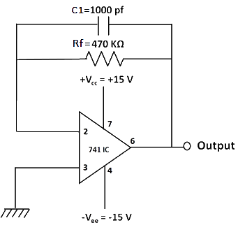

### **A. Measurement of Input Bias Current IB**

#### Familiarise with components

  

&emsp;&nbsp;&nbsp;&nbsp;&nbsp; &nbsp;&nbsp;&nbsp;&nbsp; &nbsp;&nbsp;&nbsp;&nbsp; ")&nbsp;&nbsp;&nbsp;&nbsp; ")&nbsp;&nbsp;&nbsp;&nbsp; ")&nbsp;&nbsp;&nbsp;&nbsp; ")  

**Fig 1: Components**  

#### **a) Measurement of inverting bias current IB1**

**1.** Click on the components button to place the component on the table.  

**2.** Make connections as per the circuit diagram or connection table.  

**Fig 2: Circuit diagram to measure inverting bias current.** 

**Table 1: Connection table to measure inverting bias current.**

**3.** Click on **'Check Connection'** button to check connections. If correct, Click on **'Show output voltage'** button to view output on DMM.  
**4.** Calculate the inverting bias current using the formula:  

 

**IB1 = Vo/Rf** 

 

**5.** Click on **'Result'** button and enter the claculated value.  
**6.** Click on **'Reset'** button and proceed in the same way to calculate the input bias current at non-inverting terminal.

  
  

#### **b) Measurement of non-inverting bias current IB2**

**1.** Click on the components button to place the component on the table.  

**2.** Make connections as per the circuit diagram or connection table.  

 

**Fig 3: Circuit diagram to measure non-inverting bias current.**

**Table 2: Connection table to measure non-inverting bias current.**

  

**3.** Click on **'Check Connection'** button to check connections. If correct, Click on **'Show output voltage'** button to view output on DMM.  
**4.** Calculate the non-inverting bias current using the formula:  

**IB2 = Vo/R1** 

**5.** Click on **'Result'** button and enter the claculated value.  
**6.** The input bias current IB hence, can be calculated using the formula:  

  

**IB = (IB1 + IB2)/2** 

where, IB1 has to be calculated from previous part.  
  

### **B. Measurement of input offset current Iio**

**1.** Click on the components button to place the component on the table.  

**2.** Make connections as per the circuit diagram or connection table.  

**Fig 4: Circuit diagram to measure input offset current.**

**Table 3: Connection table to measure input offset current.**

  

**3.** Click on **'Check Connection'** button to check connections. If correct, Click on **'Show output voltage'** button to view output on DMM.  
**4.** Calculate the input offset current using the formula:  

**Iio = Vo/Rf** 

**5.** Click on **'Result'** button and enter the claculated value.  
  

### **C. Measurement of input offset voltage Vio**

**1.** Click on the components button to place the component on the table.  

 

&emsp; &emsp; &emsp; &emsp; ")&emsp; ")&emsp; ")&emsp; ")  

**Fig 5: Components**  

**2.** Make connections as per the circuit diagram or connection table.  

 

**Fig 6: Circuit diagram to measure input offset voltage.**

**Table 4: Connection table to measure input offset voltage.**

  

**3.** Click on **'Check Connection'** button to check connections. If correct, Click on **'Show output voltage'** button to view output (**Vo**) on DMM.    
**4.** Calculate the input offset voltage, **Vio** using the formula:   

**Vio** = (Vo - IioRf)/(1+Rf/Ri)

**5.** Click on **'Result'** button and enter the claculated value.  
  

### **D. Measurement of slew rate S.R.**

**1.** Click on the components button to place the component on the table.  

  

&emsp; &emsp; &emsp; &emsp; &emsp; ")  

**Fig 7: Components** 

**2.** Make connections as per the circuit diagram or connection table.  

**Fig 8: Circuit diagram to measure slew rate.**

**Table 5: Connection table to measure slew rate.**

  
  
**3.** The **input signal\*** has to be taken from the red terminal of A.F. Oscillator while the other terminal has to be grounded.  
**4.** Also, feed the input signal to channel CH1 of the C.R.O and the output from Op-Amp IC must be fed to the channel CH2.  
**5.** Click on **'Check Connection'** button to check connections. If correct, Click on **'Show output voltage'** button to view output.  
**6.** Increase the frequency of input signal using the dial\*\* on A.F. Oscillator until output wave becomes triangular. This is the required frequency **fmax** in KHz.  
**7.** Calculate the slew rate using the formula:  

 

**S.R. = 2πfmaxVm/106   V/μs**

**8.** Click on **'Result'** button and enter the calculated value.  
  
\*Amplitude of input signal 'Vm' is 3V.  
\*\* dial can be controlled through both mouse and keyboard.

 
