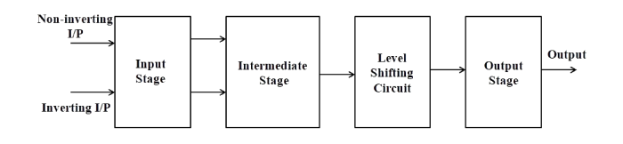
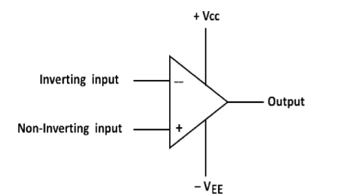
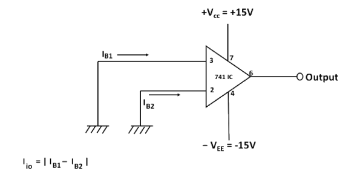
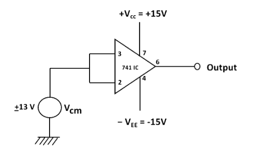
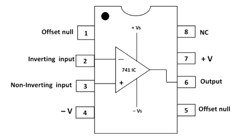

### **Introduction**

 
 
An operational amplifier is a direct coupled high gain amplifier usually consisting of one or more differential amplifiers and followed by a level translator and an output stage. The output stage is generally a push-pull or push-pull complementary-symmetry pair. An operational amplifier is available as a single integrated circuit package.

The operational amplifier is a versatile device that can be used to amplify dc as well as ac input signals and was originally designed for performing mathematical operations such as addition, subtraction, multiplication and integration. Thus, the word operational amplifier stems for its original use for these mathematical operations and is abbreviated to op-amp. With the addition of suitable external feedback components, the modern day op-amp can be used for a variety of applications, such as ac and dc signal amplification, active filters, oscillators, comparators, regulators and others.

Since an op-amp is a multistage amplifier, it can be represented by a block diagram as shown in Fig. 1.

**Fig-1: Block diagram of op-amp**

The input stage is the dual input, balanced-output differential amplifier. This stage generally provides most of the voltage gain of an amplifier and also establishes the input resistance of the op-amp. The intermediate stage is usually another differential amplifier, which is driven by the output of the first stage. In most amplifiers the intermediate stage is the dual input, unbalanced (single-ended) output. Because direct coupling is used, the dc voltage at the output of the intermediate stage is well above ground potential. Therefore, generally, the level translator (shifting) circuit is used after the intermediate stage to shift the dc level at the output of the intermediate stage downward to zero volts with respect to ground. The final stage is usually a push-pull complementary amplifier output stage. The output stage increases the output voltage swing and raises the current supplying capability of the op-amp. A well-designed output stage also provides low output resistance.

### Schematic symbol

Fig. 2 shows the schematic symbol of an op-amp

**Fig-2: Schematic symbol of op-amp**

The input differential amplifier stage of the op-amp is designed to be operated in the differential mode, the differential inputs are designated by the (+) and (-) notations. The (+) input is the non-inverting input. An ac signal (or dc voltage) applied to this input produces an in-phase (or same polarity) signal at the output. On the other hand, the (-) input is the inverting input because an ac signal (or dc voltage) applied to this input produces a 180° out of phase (or opposite polarity) signal at the output.

### Characteristics of an ideal op-amp:

An ideal op-amp would exhibit the following electrical characteristics:  
• Infinite voltage gain A.  
• Infinite input resistance Ri, so that almost any signal source can drive it and there is no loading of the preceding stage.  
• Zero output resistance Ro, so that the output can drive an infinite number of other devices.  
• Zero output voltage when input voltage is zero.  
• Infinite bandwidth, so that any frequency signal from 0 to ∞ Hz can be amplified without attenuation.  
• Infinite common-mode rejection ratio (CMRR), so that the output common mode noise voltage is zero.  
• Infinite slew rate, so that output voltage changes occur simultaneously with input voltage changes.  

### Parameters of an op-amp

#### Input offset voltage

Input offset voltage is the voltage that must be applied between the two input terminals of an op- amp to null the output as shown in Fig.3. In the figure Vdc1 and Vdc2 are dc voltages and Rs represents the source resistance. We denote input offset voltage by Vio. This voltage Vio could be positive or negative. For a 741C, the maximum value of Vio is 6mV dc. The smaller the value of Vio, the better the input terminals are matched. For instance, the 741C precision op-amps has maximum Vio\= 150µV.

**Fig-3: Input offset voltage Vio**

  

#### Input offset current

The algebraic difference between the currents into the inverting and non-inverting terminals is known as input offset current Iio(Fig. 4). In the form of an equation,

Iio = |IB1 - IB2|

where IB1 is the current into the non-inverting input and IB2 is the current into the inverting input. The input offset current for the 741C is maximum 200nA . As the matching between two input terminals is improved, the difference between IB1and IB2 becomes smaller; i.e. the Iio value decreases further. For instance, the precision op-amp 741C has a maximum value of lio equal to 6nA, a dramatic improvement over older technology.

**Fig-4: Input offset current Iio**

  

#### Input bias current

Input bias current IB, is the average of the currents that flow into the inverting and non-inverting input terminals of the op-amp. In the form of an equation,

IB = (IB1+ IB2)/2

  
IB = 500nA (maximum) for 741C, whereas for the precision 741C, it is ±7nA. The two input currents IB1 and IB2 are actually the base currents of the first differential amplifier stage.

#### Common mode rejection ratio:

The common-mode rejection ratio (CMRR) is defined as the ratio of differential voltage gain Ad to the common mode voltage gain Acm i.e,

CMRR =Ad/ Acm

The differential voltage gain Ad is same as the large-signal voltage gain A, however, the common-mode voltage gain can be determined from the circuit of Fig. 5 as

Acm =Vocm /Vcm

where -  
Vocm = output common mode voltage  
Vcm =input common mode voltage  
Acm =common mode voltage gain

**Fig-5: Common mode circuit**

Generally, the Acm is very small and Ad = A is very large; therefore, the CMRR is very large. Being a very large value, the CMRR is most often expressed in decibels(dB). For the 741C,CMRR is typically 90dB. This value of CMRR is determined under the test condition that the input source resistance Rs<10KΩ. In Fig.5 Rs is assumed to be zero because most of the practical voltage sources have negligible source resistances.

The higher the value of CMRR, the better is the matching between the two input terminals and the smaller is the output common mode voltage. For the 741C precision op-amp, CMRR =120dB. This means that the precision 741C has a better ability to reject common-mode voltages, such as electrical noise, than the 741C and is preferred in noise environments.

#### Slew rate

Slew Rate (SR) is defined as the maximum rate of change of output voltage and is expressed in volts per micro-seconds

SR= (dVo /dt)max V/µs,

  
Slew rate indicates how rapidly the output of an op-amp can change in response to changes in the input frequency. The slew rate changes with change in voltage gain and is normally specified at unity (+1) gain. The slew rate of an op-amp is fixed; therefore, if the slope requirements of the output signal are greater than the slew rate, distortion occurs. The slew rate is one of the important factors in selecting the op-amp for ac applications, particularly at relatively high frequencies.

One of the drawbacks of the 741C is its low slew rate (0.5V/µs), which limits its use in relatively high frequency applications, especially in oscillators, comparators and filters. The newer op-amps: LF351, µAF771 and MC 34001 which are direct replacements for 741, have a slew rate of 13V/µs. In high speed op-amps, specially, the slew rate is significantly improved. For instance, the LM318 has a slew rate of 70V/µs.

### Op-amp IC-741 pin configuration

The pin configuration of IC-741 general purpose operational amplifier is shown in Fig. 6. The reference point of the chip is the notch at the top. The pins are numbered in a counter clockwise direction, starting at the notch.

**Fig-6: Pin diagram of op-amp IC-741**

➢ **Pin 1** and **Pin 5** are offset null pins. Offset null is a calibration feature of the op-amp. The op-amp is so sensitive to the input voltage that at times, the output will generate a signal even when there is no intentional input. To avoid this condition for certain applications, offset null pins are provided. They are usually connected to a variable resistance such as a potentiometer. The potentiometer can be adjusted to produce a zero-output voltage from Pin 6.  
➢ **Pin 2** and **Pin 3** are two input pins. Both inputs, pin 2 and pin 3, generate an output at Pin 6, but they generate opposite polarities. Pin 2 is the inverting input. Any signal applied to Pin 2 generates a signal of opposite polarity at the output. The non-inverting input, Pin 3, generates an outputof the same polarity at Pin 6 .  
➢ Power to the op-amp is provided through **Pin 4** and **Pin 7**. Pin 4 is either connected to ground or a negative voltage value from 3 to 18 volts. Pin 7 is connected to the positive voltage of the power supply.  
➢ The output of the amplifier is at **Pin 6**.  
➢ **Pin 8** is not used. 'NC' stands for no connection.

